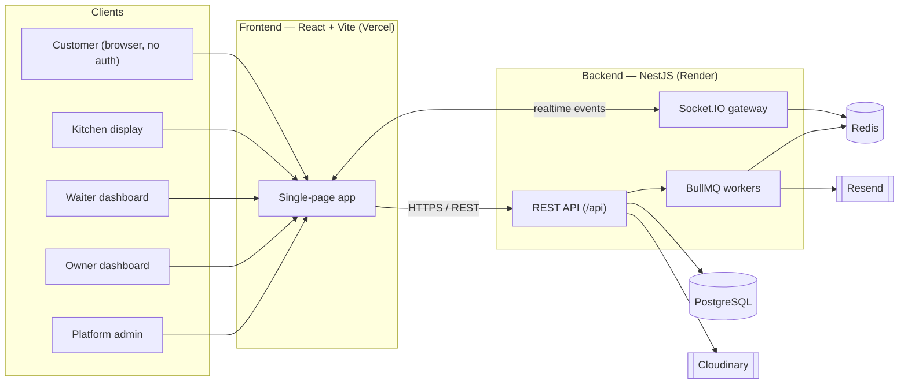
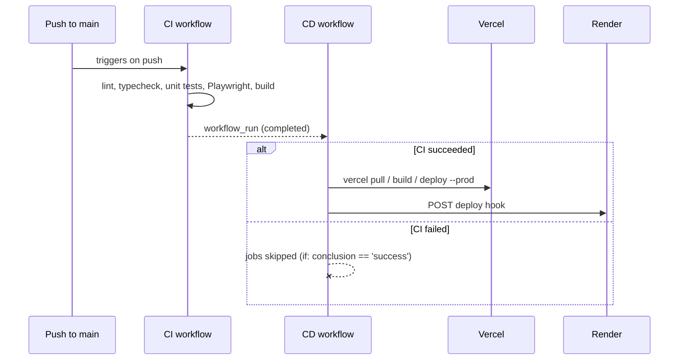

# QuickTable

**QuickTable** is a real-time, multi-tenant restaurant management platform. Customers scan a QR code at their table, browse the menu, and order — while the kitchen and waitstaff see and act on that order live, with no polling or page refreshes anywhere in the loop.

[](https://github.com/chayma958/QuickTable/actions/workflows/ci.yml)
[](https://github.com/chayma958/QuickTable/actions/workflows/cd.yml)

---

## Table of contents

- [QuickTable](#quicktable)
  - [Table of contents](#table-of-contents)
  - [Overview](#overview)
  - [Features](#features)
  - [Tech stack](#tech-stack)
  - [Architecture](#architecture)
  - [Folder structure](#folder-structure)
  - [Local setup](#local-setup)
  - [Environment variables](#environment-variables)
  - [Running the project](#running-the-project)
  - [Running Playwright tests](#running-playwright-tests)
  - [Running GitHub Actions](#running-github-actions)
  - [Deployment architecture](#deployment-architecture)
  - [Future improvements](#future-improvements)

---

## Overview

A restaurant signs up, sets up its menu and tables, and gives each table a QR code. From there:

1. A **customer** scans the code, browses the menu, adds items to a cart, and places an order — no app download, no account required.
2. The **kitchen** sees the order appear on its display the instant it's placed, and walks it through *Incoming → Preparing → Ready*.
3. The **waiter** is notified the moment an order is ready, delivers it, and marks it served or handles payment and table requests.
4. The **owner** manages the menu, tables, staff, coupons, and reviews for their restaurant from a dashboard, with live sales and table-status views.
5. A **platform admin** oversees every restaurant tenant on the platform from a single console.

All of this is pushed over WebSockets in real time, a customer's order-tracking page, the kitchen display, and the waiter dashboard all update live off the same event stream, which is what the end-to-end tests in [`e2e/`](e2e/) actually verify (see [`realtime-order-lifecycle.spec.ts`](e2e/tests/realtime-order-lifecycle.spec.ts)).

## Features

**Customer (no login required)**
- QR-code table entry (`/r/:slug/table/:number`)
- Menu browsing with categories, search, and item detail sheets
- Cart, checkout, and live order tracking through every status change
- Post-order reviews

**Kitchen**
- Real-time order queue across Incoming / Preparing / Ready columns
- Per-item prep notes and waiter-notification handoff

**Waiter**
- Live table overview ("My Tables" / "All Tables")
- Ready-order notifications, table requests, marking orders served or paid

**Owner**
- Menu & category management (drag-to-reorder), table management, QR generation
- Staff management via email invitations (role-scoped: kitchen / waiter)
- Coupons, restaurant profile/settings (hours, amenities, gallery), reviews, audit log

**Platform admin**
- Cross-tenant restaurant oversight and subscription plans

## Tech stack

| Layer | Technology |
|---|---|
| Frontend | React 19, TypeScript, Vite, React Router, TanStack Query, React Hook Form + Zod, Tailwind CSS, Socket.IO client, Framer Motion |
| Backend | NestJS 11, TypeScript, Prisma ORM, PostgreSQL, Redis, BullMQ (background jobs), Socket.IO (WebSocket gateway), Passport + JWT |
| Integrations | Cloudinary (image uploads), Resend (transactional email) |
| E2E testing | Playwright, Page Object Model, per-role auth fixtures |
| CI/CD | GitHub Actions, Vercel (frontend), Render (backend) |

## Architecture



The API and WebSocket gateway live in the same NestJS process. Redis backs both the BullMQ job queue (emails, background work) and the Socket.IO adapter, so the realtime layer scales horizontally if the backend is ever run as more than one instance.

## Folder structure

```
QuickTable/
├── backend/                 # NestJS API + WebSocket gateway
│   ├── src/
│   │   ├── auth/             # JWT auth, guards, roles
│   │   ├── restaurants/      # Tenant/restaurant management
│   │   ├── menu/             # Categories & menu items
│   │   ├── tables/           # Tables, QR codes, table requests
│   │   ├── orders/           # Order lifecycle, kitchen notes
│   │   ├── employees/        # Staff management
│   │   ├── invitations/      # Email-based staff onboarding
│   │   ├── coupons/          # Discount codes
│   │   ├── reviews/          # Post-order reviews
│   │   ├── notifications/    # Email (Resend) + BullMQ processors
│   │   ├── realtime/         # Socket.IO gateway
│   │   ├── uploads/          # Cloudinary image uploads
│   │   └── prisma/           # PrismaService
│   └── prisma/
│       ├── schema.prisma
│       ├── migrations/
│       └── seed.ts
├── frontend/                 # React + Vite SPA
│   └── src/
│       ├── api/               # API client functions
│       ├── features/          # Feature-scoped components/hooks, by role
│       ├── pages/              # Route-level pages, by role
│       ├── layouts/            # Shell layouts per role
│       ├── components/         # Shared UI primitives
│       ├── store/               # React context (auth, cart, toast, theme)
│       ├── routes/              # Router configuration & guards
│       └── lib/                  # API/socket clients
├── e2e/                       # Playwright suite (Page Object Model)
│   ├── src/
│   │   ├── pages/               # Page objects, by role
│   │   ├── fixtures/             # test.extend fixtures wiring page objects
│   │   └── helpers/                # Test data generators
│   └── tests/                     # Spec files
├── .github/workflows/
│   ├── ci.yml                 # Lint, typecheck, unit tests, Playwright, build
│   └── cd.yml                 # Deploy to Vercel + Render after CI succeeds
└── docker-compose.yml         # Local Postgres + Redis
```

## Local setup

**Prerequisites:** Node.js 22+, Docker (for Postgres/Redis), npm.

```bash
git clone https://github.com/chayma958/QuickTable.git
cd QuickTable

# 1. Start local Postgres + Redis
docker-compose up -d

# 2. Backend
cd backend
cp .env.example .env      # fill in the values — see below
npm install
npx prisma migrate deploy
npm run seed              # creates demo accounts + a sample restaurant
npm run start:dev

# 3. Frontend (in a new terminal)
cd frontend
cp .env.example .env
npm install
npm run dev
```

The frontend runs at `http://localhost:5173`, the API at `http://localhost:3000/api`. Seeded demo logins: `owner@demo.com`, `kitchen@demo.com`, `waiter@demo.com`, `admin@demo.com` (all `demo123`).

## Environment variables

**`backend/.env`**

| Variable | Description |
|---|---|
| `NODE_ENV` | `development` \| `production` |
| `PORT` | API port (default `3000`) |
| `DATABASE_URL` | PostgreSQL connection string |
| `REDIS_HOST` / `REDIS_PORT` | Redis connection |
| `JWT_ACCESS_SECRET` / `JWT_ACCESS_EXPIRES_IN` | Access token signing secret + TTL |
| `JWT_REFRESH_SECRET` / `JWT_REFRESH_EXPIRES_IN` | Refresh token signing secret + TTL |
| `CLOUDINARY_CLOUD_NAME` / `CLOUDINARY_API_KEY` / `CLOUDINARY_API_SECRET` | Image upload provider |
| `RESEND_API_KEY` / `RESEND_FROM_EMAIL` | Transactional email provider |
| `STRIPE_SECRET_KEY` / `STRIPE_PUBLISHABLE_KEY` / `STRIPE_WEBHOOK_SECRET` | Reserved for online payments (see [Future improvements](#future-improvements)) |
| `FRONTEND_URL` | Used for CORS + links in emails |

**`frontend/.env`**

| Variable | Description |
|---|---|
| `VITE_API_URL` | Backend REST base URL, e.g. `http://localhost:3000/api` |
| `VITE_SOCKET_URL` | Backend WebSocket origin, e.g. `http://localhost:3000` |
| `VITE_STRIPE_PUBLISHABLE_KEY` | Reserved for online payments |

All four backend secrets (`JWT_ACCESS_SECRET`, `JWT_REFRESH_SECRET`, `CLOUDINARY_*`, `RESEND_API_KEY`) are required at boot — the app throws immediately on startup if any are missing.

## Running the project

| Command | Where | What it does |
|---|---|---|
| `docker-compose up -d` | repo root | Starts Postgres + Redis |
| `npm run start:dev` | `backend/` | API in watch mode |
| `npm run dev` | `frontend/` | Vite dev server |
| `npm test` | `backend/` | Jest unit tests |
| `npm run build` | `backend/` or `frontend/` | Production build |
| `npm run seed` | `backend/` | Seeds demo restaurants, staff, and menu data |

## Running Playwright tests

The [`e2e/`](e2e/) suite is a separate project targeting a running frontend + backend (local, staging, or production) via `E2E_BASE_URL` — it never starts the app itself.

```bash
# with docker-compose, the backend, and the frontend already running:
cd e2e
npm install
npx playwright install --with-deps chromium
cp .env.example .env       # set E2E_BASE_URL if not http://localhost:5173
npm test                   # headless
npm run test:ui            # interactive debugging
```

The suite covers staff authentication/authorization, the full customer ordering journey, owner menu management (verified live on the customer-facing menu), and the flagship realtime test that follows one order live across the customer, kitchen, and waiter views.

## Running GitHub Actions

Every push or pull request to `main` runs [`.github/workflows/ci.yml`](.github/workflows/ci.yml):

1. **backend** — install → generate Prisma client → lint → typecheck → unit tests → build
2. **frontend** — install → lint → typecheck → build
3. **e2e** — spins up ephemeral Postgres + Redis, migrates and seeds the database, boots the built backend and a built-and-served frontend, then runs the full Playwright suite
4. **ci-success** — a single required check that only passes once all three jobs above have passed

You can watch runs under the repository's **Actions** tab, or locally with the [GitHub CLI](https://cli.github.com/): `gh run watch`.

## Deployment architecture

[`.github/workflows/cd.yml`](.github/workflows/cd.yml) does **not** trigger on push — it uses a `workflow_run` trigger that only fires once the CI workflow above has completed, and every job is additionally gated on `conclusion == 'success'`. This makes it structurally impossible to deploy a commit that hasn't passed lint, typecheck, unit tests, Playwright, and both production builds.



- **Frontend → Vercel**: deployed via the Vercel CLI (`vercel pull` → `vercel build --prod` → `vercel deploy --prebuilt --prod`) against the exact commit SHA that CI validated. Requires `VERCEL_TOKEN`, `VERCEL_ORG_ID`, `VERCEL_PROJECT_ID` as GitHub Secrets, and a Vercel project (root directory `frontend/`) with `VITE_API_URL`/`VITE_SOCKET_URL` set to your Render backend's URL.
- **Backend → Render**: deployed via a Render "deploy hook" — a single secret URL that, when POSTed to, redeploys using the build/start commands configured on the Render dashboard (build: `npm install && npm run build && npx prisma migrate deploy`, start: `npm run start:prod`, root directory `backend/`). Requires `RENDER_DEPLOY_HOOK_URL` as a GitHub Secret.

All credentials are supplied via GitHub Secrets — nothing is hardcoded in the workflows.

## Future improvements

- Online payments: `STRIPE_*` environment variables are already wired through both apps, but the Stripe checkout/webhook flow itself hasn't been built yet — today, orders are settled as cash/pay-on-delivery.
- A frontend unit/component test framework (e.g. Vitest) — currently the only automated unit tests are on the backend; frontend coverage is Playwright end-to-end tests only.
- Code-splitting the frontend bundle (currently a single >500 kB chunk) via route-based `import()`.
- Multi-language support (i18n) for customer-facing menus.
- Rate limiting and audit-log export on the platform-admin console.
